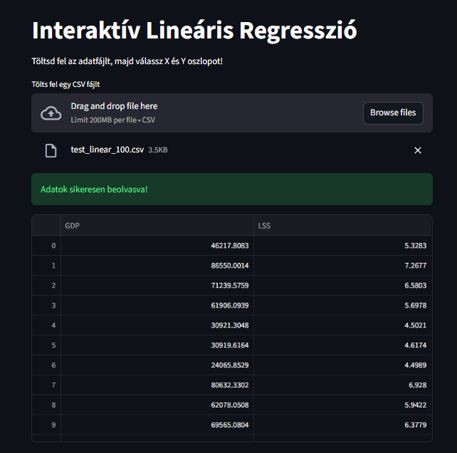
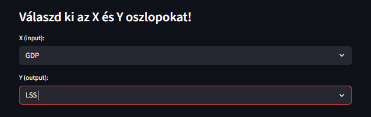
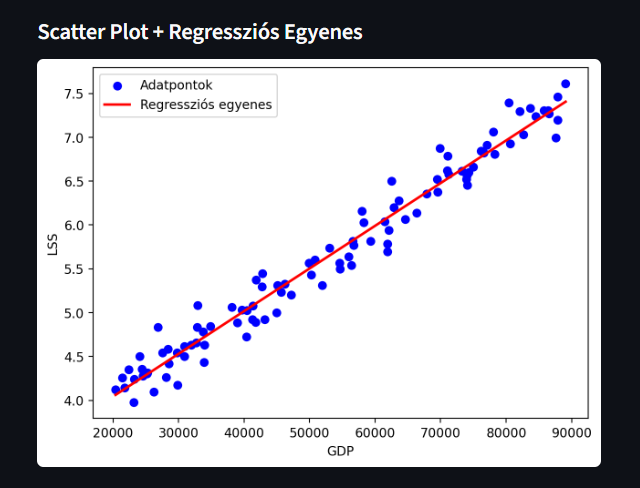
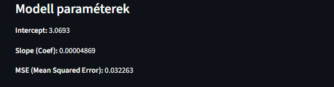
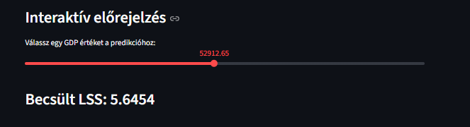

# halado_gyak_bea

## Interaktív Lineáris Regresszió – Streamlit Alkalmazás

Ez a projekt egy **interaktív, vizuális lineáris regressziós rendszer**, amelyet Python + Streamlit segítségével valósítottunk meg.  
A felhasználó képes:

- CSV fájl feltöltésére
- X és Y numerikus oszlopok kiválasztására
- Scatter plot megtekintésére
- Regressziós egyenes kirajzolására
- Modell paraméterek (intercept, coef) megtekintésére
- MSE hibamérték kiszámítására
- Interaktív előrejelzésre sliderrel

A projekt **VS Code** alatt futtatható, és egyetemi beadandókhoz tökéletes.

---

## Funkciók

### 1. CSV fájl feltöltése (sidebar)

A felhasználó a bal oldali panelen keresztül tölthet fel `.csv` adatfájlt.

### 2. X és Y oszlopok kiválasztása

Csak numerikus oszlopok jelennek meg a legördülő listában.

### 3. Scatter plot megjelenítése

A betöltött adatok pontdiagramon jelennek meg.

### 4. Lineáris regressziós modell

A rendszer automatikusan:

- betanítja a modellt
- kiszámítja az egyenest
- kirajzolja a regressziós vonalat

### 5. Modell metrikák

Az alkalmazás valós időben megjeleníti:

- Intercept
- Slope (Coefficient)
- Mean Squared Error (MSE)  
  

### 6. Interaktív előrejelzés sliderrel

A felhasználó egy csúszkán mozgathatja az X értéket → a modell kiszámítja a hozzá tartozó Y-t.

## Csomagok

pip install streamlit scikit-learn pandas matplotlib

## El inditás

python -m streamlit run app.py
